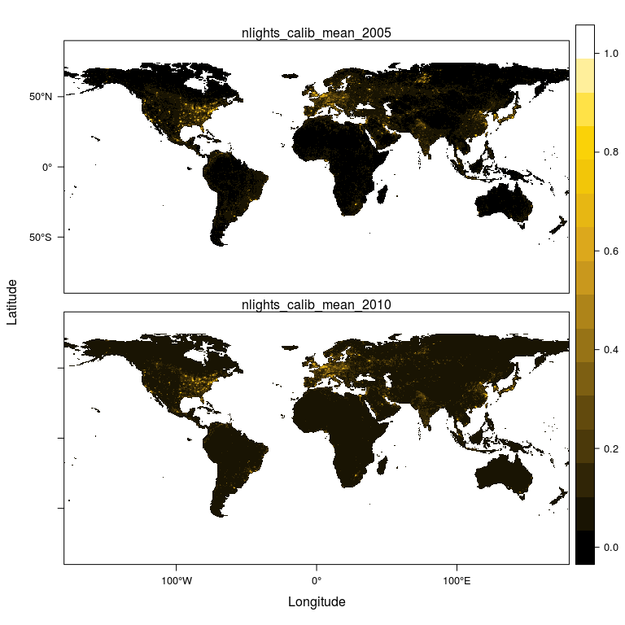

pgrid: Access PRIO GRID raster data in R
========================================

The pgrid package allows conveniently creating raster data sets (more
specifically: [VeloxRaster objects](https://github.com/hunzikp/velox))
from the PRIO GRID raw data as distributed at <http://grid.prio.org>.

Installation
------------

Install pgrid straight from github:

    require(devtools)
    devtools::install_github('hunzikp/pgrid')

Usage
-----

### Get and link the data

Before using the pgrid package you need to download the PRIO GRID data
in csv format from the [PRIO GRID download
portal](http://grid.prio.org/#/download). You don't need to download all
the available variables, but obviously, when using pgrid, you'll only
have access to those variables you downloaded.

Once you've downloaded the static and/or yearly PRIO GRID data you're
interested in, you need to let pgrid know where those files are located.
To do so, use the `setDataPath` function, e.g. as follows:

    library(pgrid)

    ## Set paths
    setDataPath(staticPath = '/home/hunzikp/Data/priogrid/PRIO-GRID Static Variables - 2017-12-08.csv',
                yearlyPath = '/home/hunzikp/Data/priogrid/PRIO-GRID Yearly Variables for 1946-2014 - 2017-12-08.csv')

### Get information about variables

To see what PRIO GRID variables the pgrid package has access to, use the
`getVarNames` function. If the `details` option is turned on, the
function returns additional information about variable sources, etc.

Here we inquire what *static* PRIO GRID variables pgrid has access to:

    ## Get info about static variables
    static.df <- getVarNames(type = 'static', details = TRUE)
    names(static.df)

    ##  [1] "name"            "id"              "displayName"    
    ##  [4] "description"     "category"        "type"           
    ##  [7] "algorithm"       "default"         "startYear"      
    ## [10] "endYear"         "sourceName"      "sourceUrl"      
    ## [13] "sourceReference" "version"         "unit"

    head(static.df[,c('name', 'displayName', 'unit')])

    ##          name                     displayName unit
    ## 6     agri_gc    Agriculture land (Globcover)    %
    ## 7  aquaveg_gc  Aquatic vegetation (Globcover)    %
    ## 8   barren_gc         Barren land (Globcover)    %
    ## 9     cmr_max     Child malnutrition (%), max    %
    ## 10   cmr_mean Child malnutrition (%), average    %
    ## 11    cmr_min     Child malnutrition (%), min    %

And equivalently, what *yearly* variables pgrid has access to:

    ## Get info about yearly variables
    yearly.df <- getVarNames(type = 'yearly', details = TRUE)
    head(static.df[,c('name', 'displayName', 'unit')])

    ##          name                     displayName unit
    ## 6     agri_gc    Agriculture land (Globcover)    %
    ## 7  aquaveg_gc  Aquatic vegetation (Globcover)    %
    ## 8   barren_gc         Barren land (Globcover)    %
    ## 9     cmr_max     Child malnutrition (%), max    %
    ## 10   cmr_mean Child malnutrition (%), average    %
    ## 11    cmr_min     Child malnutrition (%), min    %

### Get raster data

The `getPrioRaster` function returns PRIO GRID data as rasters. In the
following, we construct a raster containing distances to the nearest
urban center in one band (a static variable), and nightlight emission
data for all available years between 2005 and 2010 in the other bands.
Note that `getPrioRaster` returns a list with two elements: (1) the
actual raster data, and (2) a data frame containing meta data.

    ## Get raster data
    prio.ls <- getPrioRaster(names = c('ttime_mean', 'nlights_mean'), years = 2005:2010)
    prio.vx <- prio.ls$raster
    meta.df <- prio.ls$meta

The meta data frame links the requested variables to the raster bands:

    ## Show meta data
    head(meta.df)

    ##           name year band
    ## 1 nlights_mean 2005    1
    ## 2 nlights_mean 2006    2
    ## 3 nlights_mean 2007    3
    ## 4 nlights_mean 2008    4
    ## 5 nlights_mean 2009    5
    ## 6 nlights_mean 2010    6

The raster data is returned as a [VeloxRaster
object](https://github.com/hunzikp/velox). If we want to plot it, we can
cast it as a `RasterStack`. In the following, we use the excellent
[rasterVis](https://oscarperpinan.github.io/rastervis/) package for
plotting.

    ## Cast raster data as RasterStack
    prio.stk <- prio.vx$as.RasterStack()

    ## Plot nightlights in 2005/2010
    library(raster)
    library(rasterVis)
    nightPalette <- colorRampPalette(c("black", 
                                       rgb(218,165,32,maxColorValue=255), 
                                       rgb(255,215,0,maxColorValue=255), 
                                       "white"), bias = 0.5)
    nightTheme <- rasterTheme(region = nightPalette(20))
    levelplot(prio.stk[[meta.df$band[meta.df$name == 'nlights_mean' & meta.df$year %in% c(2005,2010)]]], 
              maxpixels = 720*360, 
              par.settings = nightTheme)

